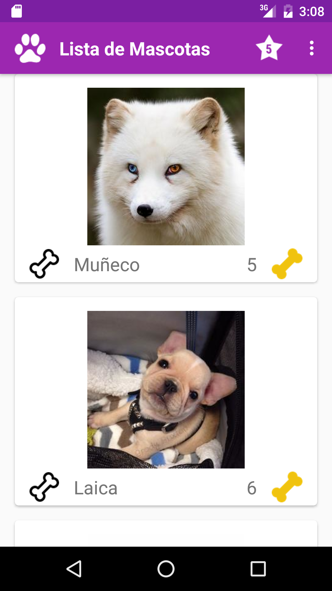
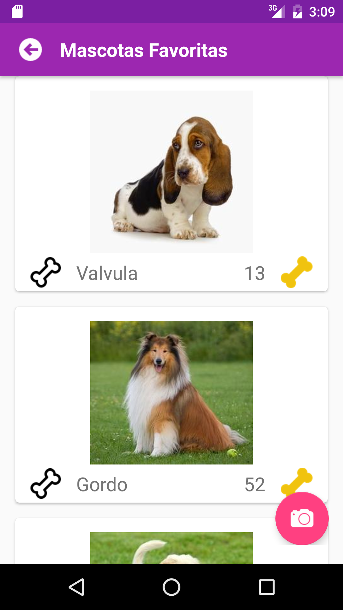

# Petagram
> - Proyecto que integra Material Design con identidad personalizada.

## Actividad Principal 
Activity principal con recycler view de mascotas.

- Cardview para cada item del recycler view con foto, nombre, Action View estrella que nos lleva a la segundo activity (Mascotas Favoritas), boton de likes de la mascotas que nos guste mas y un boton camara (que a futuro subirá una nueva mascota).

##

- Boton_Like: Muestra un mensaje "Le diste like a (nombre de la mascota)".

## Actividad Favoritos 
Activity que muestra una lista de mascotas Favoritas.

- Cardview para cada item del recycler view con foto, muestra un RecyclerView con 5 mascotas “Dummy” o Hardcodeadas.

##

- Boton_Camera: Muestra un mensaje "subir nueva mascota " .

## Action View Estrella 
> - Al dar Click en el icono estrella nos lleva a la segunda actividad MascotaFavorita.java

